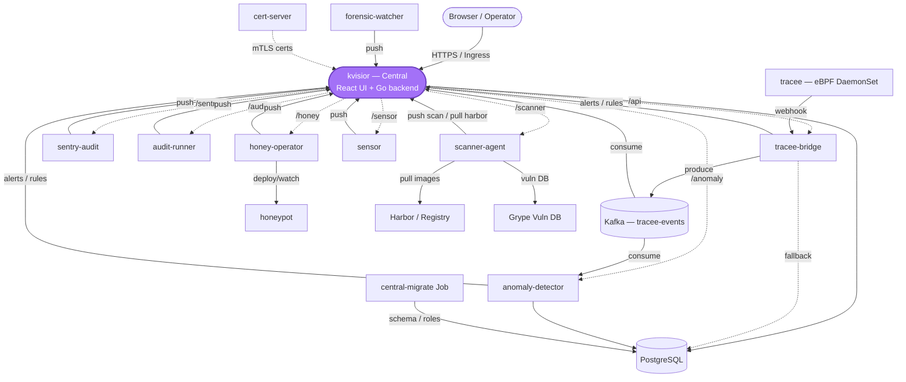

<p align="center">
  
</p>

<p align="center">Kubernetes runtime-security platform — one central UI/backend surrounded by security agents, all talking over mandatory mTLS.</p>

---

A central service (`kvisior`) serves the React UI and proxies to a set of Go
agents that watch the cluster: eBPF syscalls (via Tracee), Kubernetes audit
events, file/forensic changes, image vulnerabilities, honeypots, and behavioural
anomalies. Every service-to-service call is mTLS with certificates issued and
rotated by `cert-server`. Deployment is a single Helm chart into the
`wolfee-watcher` namespace.

## Architecture

Renders on GitHub. An interactive version (drag, click-to-highlight, dark mode)
lives at [`docs/architecture.html`](docs/architecture.html).



`cert-server` issues rotating TLS 1.3 client certs to every Go service; those
edges are omitted above for readability.

## Features

In addition to Kubernetes audit monitoring, Wolfee-Watcher includes:

- **Honeypots** for recording connections and login attempts.
- **Container forensics** with file change history, logs, and TAR export.
- **Syscall monitoring** through Tracee/eBPF, with filters by pod and event.
- **Tracepoints** for kernel events such as module loading and process switches.
- **LSM hooks** for monitoring file, process, socket, and BPF operations inside
  the kernel.
- **FSTEC BDU mapping** for matching detected CVEs with BDU records.

### FSTEC database

The database is not included in this repository. To enable FSTEC enrichment,
download the latest database file from the official FSTEC website and make it
available to `scanner-agent`.

## Quick start (single-node dev)

```bash
# 1. Build all images and import them into the node's containerd
./1.sh

# 2. Generate a CA + per-service certs
cd pkg/certgen && go run . -out ../../deploy/certs -namespace wolfee-watcher && cd ../..

# 3. Namespace + CA secret
kubectl create ns wolfee-watcher
kubectl apply -f deploy/certs/00-ca-key-secret.yaml -n wolfee-watcher

# 4. Install
helm install wolfee-watcher ./helm -n wolfee-watcher \
  --set namespace.create=false \
  --set global.internalPushSecret="$(openssl rand -hex 32)" \
  --set ui.ingress.host=kvisior8.127.0.0.1.nip.io \
  --set ui.ingress.denyInternalPaths=true \
  --set networkPolicy.nodeCIDRs="{10.0.0.0/8}"
```

The initial admin password is printed once in the migrate Job log:

```bash
kubectl logs -n wolfee-watcher job/central-migrate
```

Open the UI at the `ui.ingress.host` you set.

## Production notes

- **Multi-node:** build and push images to a registry, then set
  `image.repository`, `image.tag`, and `image.pullPolicy: IfNotPresent`. The
  single-node default (`localhost/wolfee-watcher/*`, `pullPolicy: Never`)
  requires the image to exist on each node.
- **`global.internalPushSecret` is required** — an empty value disables auth on
  the `/internal/push/*` endpoints, so the install fails closed.
- **`networkPolicy.nodeCIDRs` is required** when `networkPolicy.enabled=true`
  (default) with Tracee: Tracee runs hostNetwork and reaches `tracee-bridge:8080`
  from node IPs. The chart fails the render if it is unset.
- **mTLS is mandatory** — no plaintext fallback. Missing CA material means pods
  refuse to start.
- **Install via Helm only**, and **not** with `--wait`: the `central-migrate`
  hook and the pods' `wait-for-schema` init deadlock under `--wait`.
- **Own your CA.** The test CA in `deploy/certs/` has its key committed — dev
  only, never production.
- Review before real use: Postgres password/`sslmode`, per-service DB
  credentials, image tags, Kafka replication, and HA (replicas, PDBs).

The schema is owned by the `central-migrate` Job: it applies DDL, seeds the
`admin` account, and creates one least-privilege role per service. Only
`kvisior` and `anomaly-detector` hold direct DB access; `tracee-bridge` writes
to Postgres only as a fallback when Central is down.

## Docs

- [`DEPLOY.md`](DEPLOY.md) — full deployment reference
- [`helm/UPGRADE.md`](helm/UPGRADE.md) — upgrade notes
- [`CONTRIBUTING.md`](CONTRIBUTING.md) — build, layout, conventions
- [`SECURITY.md`](SECURITY.md) — reporting vulnerabilities

## License

[MIT](LICENSE) © Anton Karpov
